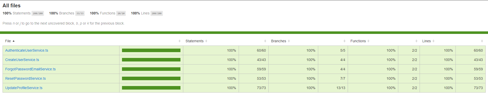

# Cadastro de usuários e autenticação.

## Web

## Mobile

## Back end

Language: Typescript/Javascript;

Techs: node, tsyringe, jwt, typeorm, postgresql, express, bcryptjs;

Methodology: SOLID, DDD, TDD;

# Testes unitários.

