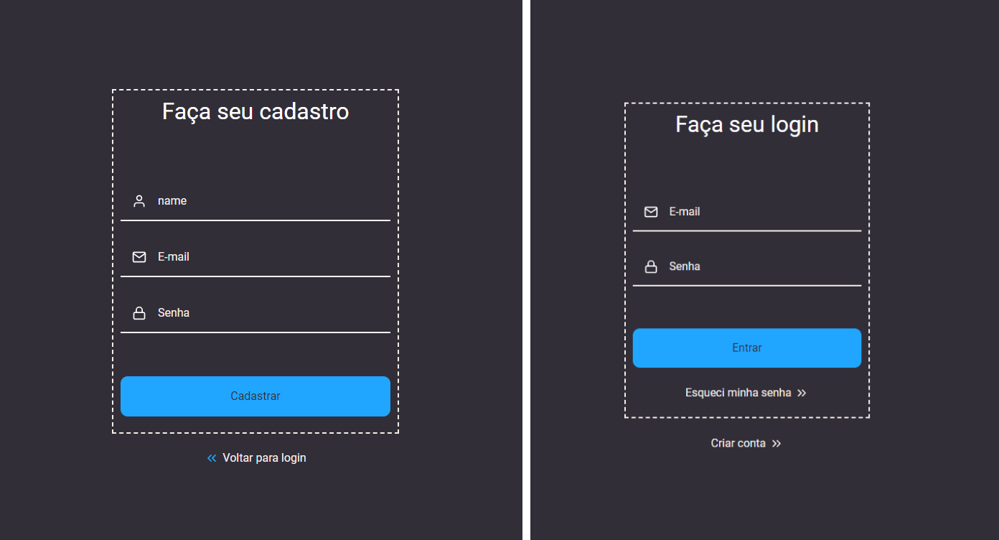
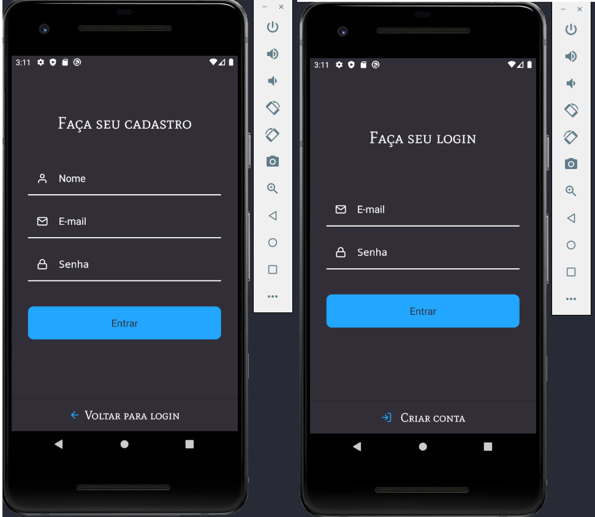

# Cadastro de usuários e autenticação.

Esse projeto eu quis aprofundar um pouco mais em metodologias no Back-end tais como, SOLID, DDD e TDD.
No front-end e mobile, aprendendo, boas práticas, controle de rotas privadas, refresh token no react e react-native, tooltip, hooks, configurações de fontes, ícones no cli, etc.

## Backend

- Language: Typescript/Javascript;

- Dependence: tsyringe, jwt, typeorm, postgresql, express, bcryptjs, jest;

- Methodology: SOLID, DDD, TDD;

> Para Rodar o projeto com o Docker

```bash
docker-compose up -d
```

# Testes unitários.

<div align="center">


</div>

---

## Frontend

- Language: Typescript/Javascript;

> Para Rodar o projeto com o Docker

```bash
yarn

#ou

npm install
```

```bash
yarn start

#ou

npm run start
```

<div align="center">



</div>

## Mobile

- Language: Typescript/Javascript;

> Para Rodar o projeto com o Docker

```bash
yarn

#ou

npm install
```

```bash
 yarn android
```

```bash
adb reverse tcp:3333 tcp:3333
```

<div align="center">



</div>
